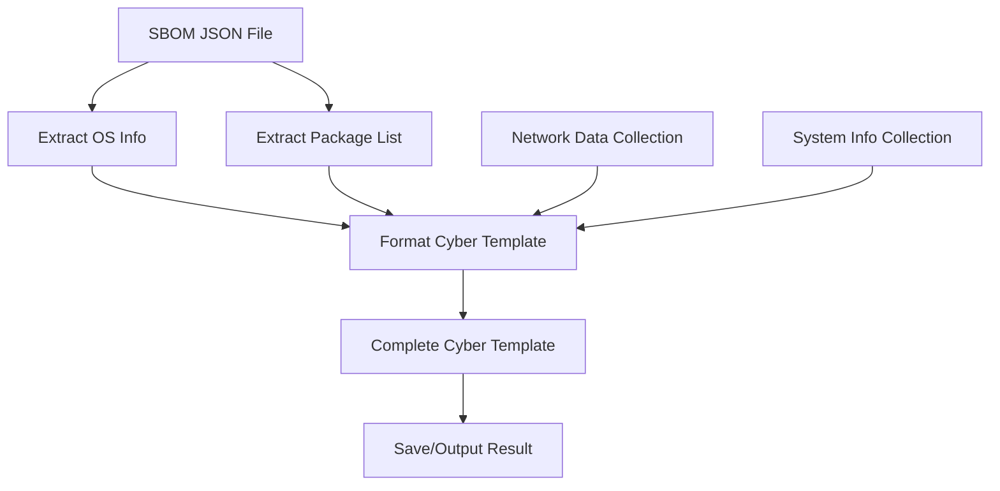

# SBOM to Cyber Template Extraction Process

This document describes the complete process to extract SBOM (Software Bill of Materials) data and produce the full cyber template used by the Cyber Penetration Testing framework.

## Overview

The cyber penetration testing framework uses structured templates to represent system information for analysis. The `extract_sbom_to_template.py` script automates the process of:

1. **Reading CycloneDX SBOM files** - Parse standardized SBOM data from JSON files
2. **Extracting package information** - Process all software components and versions
3. **Generating cyber templates** - Create both legacy and full template formats
4. **Integrating network data** - Include MAC addresses and port information
5. **Adding system metadata** - Include processes, interfaces, and system details

## Process Flow



## File Structure

### Input Files
- `sbom_results/control_server.sbom` - CycloneDX SBOM in JSON format
- `sbom_results/*.sbom` - Other SBOM files for different systems

### Generated Files
- `host_agent/cyber_data.json` - Legacy cyber template format
- `host_agent/cyber_data_full.json` - Complete cyber template with system info
- `host_agent/extracted_cyber_template.json` - SBOM-extracted template

### Scripts
- `host_agent/sbom/os_sbom.py` - SBOM generation utilities
- `host_agent/extract_sbom_to_template.py` - Main extraction script
- `host_agent/fix_sbom.py` - SBOM normalization utilities

## Usage

### Generate Cyber Template from SBOM

```bash
# Generate complete cyber template from SBOM
python3 host_agent/extract_sbom_to_template.py sbom_results/control_server.sbom -o cyber_template_output.json

# Generate legacy format only (cyber_template_data section)
python3 host_agent/extract_sbom_to_template.py sbom_results/control_server.sbom --template-only > legacy_template.json

# Process multiple SBOMs
for sbom in sbom_results/*.sbom; do
    output="${sbom%.sbom}_template.json"
    python3 host_agent/extract_sbom_to_template.py "$sbom" -o "$output"
done
```

### Generate SBOM First (if needed)

```bash
# Use existing agent to collect SBOM
cd host_agent/
python3 agent.py sbom --output ../sbom_results/generated.sbom

# Or generate directly
python3 agent.py sbom --format cyclonedx --output ../sbom_results/generated.sbom
```

## Cyber Template Structure

### Legacy Format (cyber_template_data only)
```json
{
  "OS": "Ubuntu 24.04.2 LTS 24.04.2 LTS (Noble Numbat)",
  "lib": [
    "{'name': 'package_name', 'version': '1.0.0', 'type': 'deb'}",
    // ... package entries
  ],
  "MAC": ["b0:4f:13:05:c6:90", "80:6d:97:56:e5:e3"],
  "port": [
    {"id": "128.61.144.211:52944", "Protocol": "TCP"},
    // ... port entries
  ]
}
```

### Full Format (Complete Template)
```json
{
  "cyber_template_data": {
    // Same as legacy format above
  },
  "system_info": {
    "agent_id": "193853668050576",
    "hostname": "hostname.local",
    "os": "Linux",
    "os_version": "#version",
    "platform": "platform-details",
    "cpu_count": 36,
    "memory_total": 134758199296,
    "interfaces": [
      {"name": "eno1", "ip": "192.168.1.100", "mac": "aa:bb:cc:dd:ee:ff"}
    ],
    "processes": [
      {"pid": 1, "name": "systemd"},
      {"pid": 2, "name": "kthreadd"}
    ]
  },
  "collection_timestamp": "2025-10-03T12:34:56.789012"
}
```

## SBOM Data Sources

The script supports CycloneDX format SBOMs with the following component types:

- **deb packages** (Ubuntu/Debian): `pkg:deb/ubuntu/package@version`
- **rpm packages** (RHEL/CentOS/Fedora): `pkg:rpm/centos/package@version`
- **Generic packages**: `pkg:generic/package@version`
- **Windows apps**: Detected from PURLs containing "windows"

## Integration with Dashboard

The generated cyber templates can be used by the dashboard for:

1. **Vulnerability scanning** - Cross-reference with vulnerability databases
2. **Compliance checking** - Verify package versions and configurations
3. **System monitoring** - Track changes in installed software
4. **Penetration testing** - Identify potential attack vectors

### Dashboard Integration Example

```python
# In dashboard/views.py - load and process cyber template
import json
from pathlib import Path

def load_cyber_template(template_path):
    with open(template_path, 'r') as f:
        data = json.load(f)

    # Extract package information for vulnerability checking
    packages = []
    for pkg_str in data['cyber_template_data']['lib']:
        # Parse package string to extract name/version
        # Add to packages list for processing
        pass

    return data
```

## Automation and CI/CD Integration

### Automated Template Generation

```bash
#!/bin/bash
# generate_templates.sh
set -e

echo "Generating cyber templates from SBOM files..."

# Process all SBOM files
for sbom_file in sbom_results/*.sbom; do
    base_name=$(basename "$sbom_file" .sbom)
    output_file="templates/${base_name}_cyber_template.json"

    echo "Processing $sbom_file -> $output_file"
    python3 host_agent/extract_sbom_to_template.py "$sbom_file" -o "$output_file"
done

echo "Template generation complete."
```

### Docker Integration

```dockerfile
# In Dockerfile
COPY host_agent/extract_sbom_to_template.py /app/
COPY sbom_results/ /app/sbom_results/
RUN python3 /app/extract_sbom_to_template.py /app/sbom_results/control_server.sbom -o /app/cyber_template.json
```

## Error Handling and Validation

The script includes comprehensive error handling for:

- **Missing SBOM files** - Clear error messages and exit codes
- **Invalid JSON** - JSON parsing error detection
- **Missing components** - Graceful handling of incomplete SBOMs
- **PURL parsing failures** - Fallback to generic package types

### Validation Example

```python
def validate_cyber_template(template_path):
    """Validate generated cyber template structure"""
    required_keys = ['cyber_template_data', 'system_info', 'collection_timestamp']

    try:
        with open(template_path, 'r') as f:
            data = json.load(f)

        for key in required_keys:
            if key not in data:
                return False, f"Missing required key: {key}"

        # Validate cyber_template_data structure
        ctd = data['cyber_template_data']
        required_ctd_keys = ['OS', 'lib', 'MAC', 'port']
        for key in required_ctd_keys:
            if key not in ctd:
                return False, f"Missing cyber_template_data key: {key}"

        return True, "Template is valid"

    except Exception as e:
        return False, f"Template validation error: {e}"
```

## Performance Considerations

### Large SBOM Processing
- SBOM files can contain thousands of components (e.g., control_server.sbom has 2177+)
- The script limits template package display to 100 entries for readability
- Memory usage scales with SBOM size but is generally efficient

### Optimization Tips
- Use `--template-only` flag for smaller output when full system info isn't needed
- Process large SBOMs in batches if memory constraints exist
- Cache processed templates to avoid repeated processing

## Troubleshooting

### Common Issues

1. **Import errors**: Ensure all dependencies are installed
   ```bash
   pip install -r requirements.txt
   ```

2. **Permission errors**: Run with appropriate file access permissions
   ```bash
   sudo python3 host_agent/extract_sbom_to_template.py sbom_file.sbom
   ```

3. **Memory issues with large SBOMs**: Process in chunks or increase system memory
   ```bash
   # Split large SBOM processing
   python3 -c "
   import json
   with open('large.sbom') as f:
       data = json.load(f)
   # Process in chunks
   "
   ```

### Debugging

Enable verbose output in dependent scripts:
```bash
python3 host_agent/agent.py cyber --format full --output debug_template.json
```

## Future Enhancements

### Planned Features
- **Vulnerability correlation**: Automatic CVSS score assignment using vulnerability databases
- **Package dependency graphing**: Generate dependency trees from SBOM data
- **Template diffing**: Compare cyber templates across different collections
- **Export formats**: Support for additional template formats (XML, YAML, etc.)

### Integration Opportunities
- **Kubernetes SBOMs**: Process SBOMs from containerized deployments
- **CI/CD pipelines**: Automated template generation in build pipelines
- **Compliance frameworks**: NIST, CIS, and other security framework mapping

## Related Documentation

- [README.md](../README.md) - Main project documentation
- [README.md](./README.md) - Host agent details
- [Cyber Threat Intelligence Integration](./cyber_intel.md) - Integration with threat databases

---

*Last updated: October 3, 2025*
