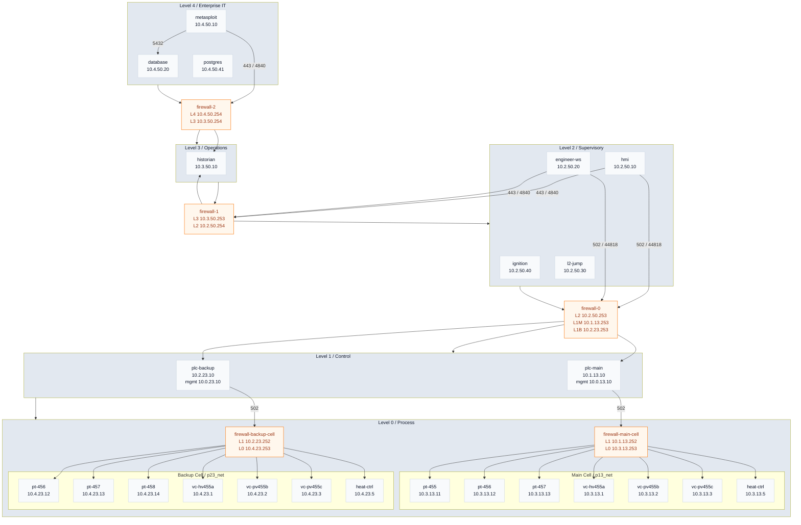

# Purdue model docker lab

This lab turns your diagram into a runnable Docker Compose environment that approximates a Purdue-style ICS network.

## What is included

- Layer 4: `metasploit`, `database`, `historian-db` (InfluxDB archive), `postgres`
- Layer 3: `historian`
- Firewalls: `firewall-2`, `firewall-1`, `firewall-0`, `firewall-main-cell`, `firewall-backup-cell`
- Layer 2: `hmi`, `ignition`, `engineer-ws`, `l2-jump`
- Layer 1: `plc-main`, `plc-backup`
- Layer 0: `pt-455`, `pt-456`, `pt-457`, `pt-458`, `vc-hv455a`, `vc-pv455b`, `vc-pv455c`, `heat-ctrl`

## Topology Diagram



Policy notes:

- Allowed: `metasploit -> historian` on `443` and `4840`
- Allowed: `metasploit -> database` on `5432`
- Allowed: `metasploit -> postgres` on `5432`
- Allowed: `database -> metasploit` on `4444`
- Allowed: `hmi -> historian` and `engineer-ws -> historian` on `443` and `4840`
- Allowed: `historian -> postgres` on `5432`
- Allowed: `hmi -> plc-backup` and `engineer-ws -> plc-main` on `502` / `44818` through `firewall-0`
- Allowed: `plc-main` and `plc-backup` talk to Layer 0 devices on `502` only through `firewall-main-cell` and `firewall-backup-cell`
- Blocked: `metasploit -> hmi` on `443`
- Blocked: `hmi -> database` on `5432`
- Blocked: `hmi -> postgres` on `5432`
- Blocked: `metasploit -> plc-main` on `502`
- Blocked: `hmi -> pt-455` on `502`
- Blocked: `hmi -> metasploit` on `4444`
- Isolated: `mgmt13_net` and `mgmt23_net` remain unreachable from Layers 2-4; host-side PLC UI access still comes through the published Docker ports

## Layer-Oriented Network Inventory

| Purdue layer | Purpose | Containers | Networks | Current reachability |
|---|---|---|---|---|
| Layer 4 | Enterprise IT | `metasploit`, `database`, `historian-db`, `postgres` | `l4_net` `10.4.50.0/24` | Same-segment access to `database` and `postgres`; routed access from `metasploit` to the InfluxDB historian through `firewall-2`; no explicit routes to Layer 1, Layer 0, or PLC management subnets |
| Layer 3 | Operations / DMZ | `firewall-1`, `firewall-2` | `l3_net` `10.3.50.0/24` | `firewall-1` mediates Layer 2 traffic and `firewall-2` mediates Layer 4 traffic |
| Layer 2 | Supervisory / operator access | `hmi`, `ignition`, `engineer-ws`, `l2-jump`, `firewall-0`, `firewall-1` | `l2_net` `10.2.50.0/24` | Same-segment access inside Layer 2; routed historian access on `443` and `4840`; routed PLC access on `502` and `44818`; no explicit routes to Layer 0 or PLC management subnets |
| Layer 1 | Control | `plc-main`, `plc-backup`, `firewall-0`, `firewall-main-cell`, `firewall-backup-cell` | `l1_main` `10.1.13.0/24`, `l1_backup` `10.2.23.0/24`, `mgmt13_net` `10.0.13.0/24`, `mgmt23_net` `10.0.23.0/24` | PLCs are exposed to Layer 2 only through `firewall-0`; process traffic reaches Layer 0 only through the cell firewalls; management nets stay isolated from Layers 2-4 while the PLC web UIs are published to the host |
| Layer 0 | Process I/O | `pt-455`, `pt-456`, `pt-457`, `pt-458`, `vc-hv455a`, `vc-pv455b`, `vc-pv455c`, `heat-ctrl`, `firewall-main-cell`, `firewall-backup-cell` | `p13_net` `10.3.13.0/24`, `p23_net` `10.4.23.0/24` | Field devices are reachable only through their cell firewall allowlists; Layers 2-4 do not route directly into `p13_net`, `p23_net`, or the management nets |

## Device Address Inventory

| Layer | Device | Role | IP addresses |
|---|---|---|---|
| Layer 4 | `database` | Enterprise database | `l4_net 10.4.50.20` |
| Layer 4 | `historian-db` | InfluxDB-based historian | `l4_net 10.4.50.30` |
| Layer 4 | `metasploit` | Metasploit RPC service | `l4_net 10.4.50.10` |
| Layer 4 | `postgres` | PostgreSQL server | `l4_net 10.4.50.41` |
| Layer 3 | `historian` | DMZ historian | `l3_net 10.3.50.10` |
| Boundary | `firewall-2` | Layer 4 ↔ Layer 3 firewall | `l4_net 10.4.50.254`, `l3_net 10.3.50.254` |
| Boundary | `firewall-1` | Layer 3 ↔ Layer 2 firewall | `l2_net 10.2.50.254`, `l3_net 10.3.50.253` |
| Boundary | `firewall-0` | Layer 2 ↔ Layer 1 firewall | `l2_net 10.2.50.253`, `l1_main 10.1.13.253`, `l1_backup 10.2.23.253` |
| Boundary | `firewall-main-cell` | Layer 1 ↔ Layer 0 main-cell firewall | `l1_main 10.1.13.252`, `p13_net 10.3.13.253` |
| Boundary | `firewall-backup-cell` | Layer 1 ↔ Layer 0 backup-cell firewall | `l1_backup 10.2.23.252`, `p23_net 10.4.23.253` |
| Layer 2 | `hmi` | Human-machine interface | `l2_net 10.2.50.10` |
| Layer 2 | `ignition` | Ignition gateway / SCADA runtime | `l2_net 10.2.50.40` |
| Layer 2 | `engineer-ws` | Engineering workstation | `l2_net 10.2.50.20` |
| Layer 2 | `l2-jump` | Jumpbox / utility node | `l2_net 10.2.50.30` |
| Layer 1 | `plc-main` | Primary PLC | `l1_main 10.1.13.10`, `mgmt13_net 10.0.13.10` |
| Layer 1 | `plc-backup` | Backup PLC | `l1_backup 10.2.23.10`, `mgmt23_net 10.0.23.10` |
| Layer 0 | `pt-455` | Pressure transmitter | `p13_net 10.3.13.11` |
| Layer 0 | `pt-456` | Pressure transmitter | `p13_net 10.3.13.12`, `p23_net 10.4.23.12` |
| Layer 0 | `pt-457` | Pressure transmitter | `p13_net 10.3.13.13`, `p23_net 10.4.23.13` |
| Layer 0 | `pt-458` | Pressure transmitter | `p23_net 10.4.23.14` |
| Layer 0 | `vc-hv455a` | Control valve | `p13_net 10.3.13.1`, `p23_net 10.4.23.1` |
| Layer 0 | `vc-pv455b` | Control valve | `p13_net 10.3.13.2`, `p23_net 10.4.23.2` |
| Layer 0 | `vc-pv455c` | Control valve | `p13_net 10.3.13.3`, `p23_net 10.4.23.3` |
| Layer 0 | `heat-ctrl` | Heater controller | `p13_net 10.3.13.5`, `p23_net 10.4.23.5` |

## Raw Docker Network Table

| Network | CIDR | Members |
|---|---|---|
| `l2_net` | `10.2.50.0/24` | `hmi .10`, `engineer-ws .20`, `l2-jump .30`, `ignition .40`, `firewall-0 .253`, `firewall-1 .254` |
| `l3_net` | `10.3.50.0/24` | `historian .10`, `firewall-1 .253`, `firewall-2 .254` |
| `l4_net` | `10.4.50.0/24` | `metasploit .10`, `database .20`, `historian-db .30`, `postgres .41`, `firewall-2 .254` |
| `l1_main` | `10.1.13.0/24` | `plc-main .10`, `firewall-main-cell .252`, `firewall-0 .253` |
| `l1_backup` | `10.2.23.0/24` | `plc-backup .10`, `firewall-backup-cell .252`, `firewall-0 .253` |
| `p13_net` | `10.3.13.0/24` | `vc-hv455a .1`, `vc-pv455b .2`, `vc-pv455c .3`, `heat-ctrl .5`, `pt-455 .11`, `pt-456 .12`, `pt-457 .13`, `firewall-main-cell .253` |
| `p23_net` | `10.4.23.0/24` | `vc-hv455a .1`, `vc-pv455b .2`, `vc-pv455c .3`, `heat-ctrl .5`, `pt-456 .12`, `pt-457 .13`, `pt-458 .14`, `firewall-backup-cell .253` |
| `mgmt13_net` | `10.0.13.0/24` | `plc-main .10` |
| `mgmt23_net` | `10.0.23.0/24` | `plc-backup .10` |

## Port Mapping

### Layer 4 (Enterprise)

- HTTP/HTTPS --> `80`, `443`
- Database --> container `5432`, published on host as `15432`
- PostgreSQL --> container `5432`, published on host as `25432`
- Historian UI --> container `8086`, published on host as `8086` (InfluxDB 2.x)
- Metasploit RPC --> container `4444`, published on host as `4444`

### Layer 3 (DMZ/Historian)

- OPC UA --> `4840`
- MQTT --> `1883`/`8883`
- HTTPS API --> `443`

### Layer 2 (HMI/Engineering)

- RDP --> `3389`
- VNC --> `5900`
- OPC UA Client --> `4840`
- SMB --> `445`
- Ignition gateway --> container `8088` / `8043`, published on host as `9088` / `9043`

### Layer 1 (PLCs)

- Modbus/TCP --> `502`
- Ethernet/IP --> `44818`
- Siemens --> `102`

### Layer 0 (Sensors/Actuators)

- Modbus/TCP --> `502`

## Service behavior note

Most containers in this stack are still built from `services/sim-endpoint` and expose the same JSON-over-HTTP simulator on the ports listed in `SERVICE_PORTS`. That still includes `database`, `historian`, and `l2-jump`; the Layer 4 `metasploit` service occupies the former workstation slot.

An actual PostgreSQL 15 server now runs under the `postgres` service, stores the `iaea_rcs` database on a persistent volume, and accepts connections on port `5432` from the host (`127.0.0.1:25432`) and the Layer 4 Metasploit host; credentials are `iaea`/`iaea-demo-password`.

The Layer 4 `metasploit` service runs `msfrpcd` on port `4444` (exposed to the host as `127.0.0.1:4444` and reachable from the Layer 4 Metasploit host). It is intentionally left open so the lab operators can demonstrate exploitation chains or run payload collection tools against other lab nodes. Connect with `msfconsole` (or `msfrpc`) using `msfadmin/msfadmin` to drive the RPC interface.

`plc-main` and `plc-backup` are different:

- They now build from a local OpenPLC v3 wrapper image pinned to upstream commit `b5d41356dab4aeadca0dd7ca64ba542f870b595d`.
- This stack uses OpenPLC v3 intentionally: the upstream-maintained v4 runtime is editor-driven on `8443` and is not a drop-in replacement for the existing Layer 1 `502` PLC paths in this lab.
- Port `502` is served by OpenPLC instead of the generic HTTP simulator.
- OpenPLC's built-in EtherNet/IP listener is disabled for this lab, and port `44818` remains a small HTTP compatibility listener so the existing Layer 2 firewall policy and path checks still have a responder while the PLC runtime is migrated.
- Each PLC persists its state in a named Docker volume and exposes the OpenPLC web UI to the host on `18080` and `18081`.
- On startup, each PLC now seeds a lab-specific Modbus master profile, polls the pressure transmitters in its cell, and drives the Layer 0 actuators over Modbus/TCP.
- Each PLC also runs a small OPC UA bridge on `4840`. The demo uses anonymous, no-security OPC UA sessions and exposes fixed string node IDs so the Layer 2 HMI and engineering workstation can read stable tags.
- `plc-main` serves `opc.tcp://10.1.13.10:4840/main` with namespace URI `urn:iaea-rcs-demo:main`.
- `plc-backup` serves `opc.tcp://10.2.23.10:4840/backup` with namespace URI `urn:iaea-rcs-demo:backup`.
- The new historian pair (`historian` on `l2_net` and the dual-homed `historian-db`) polls the OPC bridges every ~6 s and writes the values into InfluxDB; the historian UI is reachable on the host at `http://127.0.0.1:8086/` with the credentials `admin` / `iaea-demo-password` and the token `iaea-historian-token`.
- `firewall-0` now allows the Layer 4 historian (`10.4.50.31` and `10.2.50.31`) to reach both PLC OPC UA endpoints on `4840` so the collector can fetch Layer 0 tag data.

### Prebuilt historian dashboard

The historian ships with a ready-to-import InfluxDB dashboard (named **IAEA RCS Overview**) that renders the main/backup average pressures plus the override ownership series the stack publishes. Run the helper script from the repo root to push it into Influx:

```
INFLUX_URL=http://127.0.0.1:8086 \
INFLUX_TOKEN=iaea-historian-token \
INFLUX_ORG=iaea \
sh services/historian/import-dashboard.sh
```

If you prefer to run the import from inside the Docker network, execute the script from the historian container (for example, `docker compose exec historian sh services/historian/import-dashboard.sh`) and point `INFLUX_URL` at `http://historian-db:8086`. The script posts `Main Pressure`, `Backup Pressure`, and `Override Owners` panels so you can immediately visualize Layer 0 tag values once the historian is collecting.

The Layer 2 operator services are now different as well:

- `hmi` builds from `services/hmi` and serves a live dashboard on `80` and `443`.
- The HMI acts as an OPC UA client to both PLC bridges and exposes its current merged state on `http://127.0.0.1:8081/api/state`.
- `ignition` builds from `services/ignition`, which derives from `inductiveautomation/ignition:8.1.39`, adds `iproute2`, installs the same Layer 2 static routes as the HMI, and then hands control back to the official `/usr/local/bin/docker-entrypoint.sh`.
- The Ignition gateway is auto-commissioned on first start from Compose environment variables: `GATEWAY_ADMIN_USERNAME`, `GATEWAY_ADMIN_PASSWORD`, and `IGNITION_EDITION`.
- `engineer-ws` builds from `services/eng-ws` on top of `ubuntu:24.04`.
- The engineering workstation includes `opc-read`, `curl`, `ip`, `nc`, `ping`, and `tcpdump`, autostarts the Ignition Designer Launcher in its noVNC desktop, and serves a small status page on `80` and `443`.
- The engineering workstation image does not include a graphical web browser, so `xdg-open http://ignition:8088` will not open the gateway UI inside the desktop without adding one.
- A shell on the engineering workstation is available with `docker exec -it engineer-ws bash`.
- The Python host-oriented container images now include the host agent bundle from `host_agent/` and start it automatically when the container comes up. If `AGENT_SERVER_URL` is not set explicitly, the entrypoint prefers `http://host.docker.internal:8000` and falls back to the container gateway on port `8000`; the agent uses the shared lab token `iaea-demo-agent-token` unless you override `AGENT_API_TOKEN`.
- Non-Python services that cannot embed the agent directly use a companion `testbed/ot/agent` sidecar in the same Docker network so they still report to the dashboard.

The Layer 0 field devices are now different as well:

- `pt-455`, `pt-456`, `pt-457`, and `pt-458` expose real Modbus/TCP on `502`.
- Each PT publishes two input registers starting at address `0`: a changing pressure value and a status word.
- `pt-456` and `pt-457` remain dual-homed, so both PLCs can poll the same field device over the appropriate cell network.
- `vc-hv455a`, `vc-pv455b`, `vc-pv455c`, and `heat-ctrl` now expose writable holding registers on `502`.
- Each actuator uses the same register map: register `0` is the active owner ID, register `1` is the applied command, register `2` is the last writer ID, and register `3` is a status bitmask.
- Actuator writes target holding registers `0`-`1`: the caller writes its controller ID into register `0` and its requested command into register `1`.
- Controller ID `1` is `plc-main` and controller ID `2` is `plc-backup`. Ownership uses a 2-second lease, and the primary PLC can preempt the backup when both are alive.

Build note: the OpenPLC image downloads the pinned upstream source tarball from GitHub during `docker compose build`, and the local Ignition wrapper image installs `iproute2` with `apt-get`, so the build host needs outbound internet access.

## Important limitation

Docker can emulate network segmentation and service behavior, but it does **not** emulate real PLC firmware, industrial protocols, or layer-2 switch ASIC behavior by itself. Think of this as a cyber-range / architecture lab, not a hardware-accurate plant digital twin.

## Start

```bash
docker compose up -d --build
```

Repeatable OPC bring-up:

```bash
./scripts/up_opc_demo.sh
```

Host access note:

The `database` service is still a simulated HTTP endpoint, not a real PostgreSQL instance, so `psql -h localhost -p 15432` will not succeed. Use `curl http://localhost:15432/` to validate the listener instead.

A real PostgreSQL 15 server is available at `127.0.0.1:25432`; connect with `psql -h 127.0.0.1 -p 25432 -U iaea -d iaea_rcs` (password `iaea-demo-password`). It stores the `iaea_rcs` database on a persistent volume and can be reached from the Layer 4 Metasploit host or other Layer 4 tools that speak PostgreSQL.

The Metasploit RPC server listens on `127.0.0.1:4444`; use `msfconsole` or any RPC client with the `msfadmin/msfadmin` credentials to orchestrate payloads or demos from the host or the Layer 4 Metasploit host.

PLC access note:

- `http://127.0.0.1:18080/` reaches the `plc-main` OpenPLC web UI.
- `http://127.0.0.1:18081/` reaches the `plc-backup` OpenPLC web UI.
- `http://127.0.0.1:8086/` reaches the new Layer 4 historian UI (InfluxDB 2.x). Use `admin` / `iaea-demo-password` for the UI login and `iaea-historian-token` for API calls.
- From the host, `http://127.0.0.1:9088/web/login` and `https://127.0.0.1:9043/` reach the Layer 2 Ignition gateway.
- From the host, the generated Perspective project is available at `http://127.0.0.1:9088/data/perspective/client/iaea_rcs_scada`.
- From other containers on the Docker network, use `http://ignition:8088/web/login` for the gateway UI and `http://ignition:8088/data/perspective/client/iaea_rcs_scada` for the Perspective client.
- The hostname `ignition` is only resolvable inside the Docker network. It will not resolve from the host browser unless you add your own DNS or `/etc/hosts` entry.
- The `engineer-ws` desktop includes the Ignition Designer Launcher but no browser, so browse to the host-mapped `127.0.0.1:9088` URLs from your host machine unless you extend the image with one.
- On a fresh `ignition_data` volume, Compose auto-commissions Ignition with `IGNITION_GATEWAY_ADMIN_USERNAME` (default `admin`), `IGNITION_GATEWAY_ADMIN_PASSWORD` (default `iaea-demo-password`), and `IGNITION_EDITION` (default `standard`).
- Those bootstrap variables only affect the first launch against an empty `ignition_data` volume. To re-run commissioning from Compose, remove the volume first.
- Port `502` on the PLC containers is no longer HTTP, so validate it with a Modbus client or a TCP connect test rather than `urllib.request`.
- `plc-main` publishes a local summary on holding registers `10`-`22`: `PT-455`, `PT-456`, `PT-457`, average pressure, health code, then owner/command pairs for `vc-hv455a`, `vc-pv455b`, `vc-pv455c`, and `heat-ctrl`.
- `plc-backup` publishes the same shape on holding registers `10`-`22`, using `PT-456`, `PT-457`, and `PT-458` for the sensor half of the summary.

Current Modbus register map:

| Device | Unit ID | Registers | Meaning |
|---|---|---|---|
| `pt-455` | `1` | input registers `0`-`1` | pressure value, status |
| `pt-456` | `2` | input registers `0`-`1` | pressure value, status |
| `pt-457` | `3` | input registers `0`-`1` | pressure value, status |
| `pt-458` | `4` | input registers `0`-`1` | pressure value, status |
| `vc-hv455a` | `11` | holding registers `0`-`3` read, `0`-`1` write | owner ID, applied command, last writer ID, status word |
| `vc-pv455b` | `12` | holding registers `0`-`3` read, `0`-`1` write | owner ID, applied command, last writer ID, status word |
| `vc-pv455c` | `13` | holding registers `0`-`3` read, `0`-`1` write | owner ID, applied command, last writer ID, status word |
| `heat-ctrl` | `14` | holding registers `0`-`3` read, `0`-`1` write | owner ID, applied command, last writer ID, status word |
| `plc-main` | `1` | holding registers `10`-`22` | PT summary followed by actuator owner/command pairs |
| `plc-backup` | `1` | holding registers `10`-`22` | PT summary followed by actuator owner/command pairs |

OpenPLC monitoring and displayed register table:

The OpenPLC `Monitoring` page shows the named `%IW` and `%QW` tags below. `owner` values use `1 = plc-main` and `2 = plc-backup`. PT `status` is `1` when the simulated sensor is healthy. Actuator `*_status` is a bitmask: `1 = device alive`, `2 = owner active`, `4 = last write accepted`, `8 = last write rejected`.

Main PLC sensor inputs:

| Tag | Address | Description |
|---|---|---|
| `pt455_pv` | `%IW100` | live process value from `pt-455` |
| `pt455_status` | `%IW101` | PT health/status word for `pt-455` |
| `pt456_pv` | `%IW102` | live process value from `pt-456` |
| `pt456_status` | `%IW103` | PT health/status word for `pt-456` |
| `pt457_pv` | `%IW104` | live process value from `pt-457` |
| `pt457_status` | `%IW105` | PT health/status word for `pt-457` |

Backup PLC sensor inputs:

| Tag | Address | Description |
|---|---|---|
| `pt456_pv` | `%IW100` | live process value from `pt-456` |
| `pt456_status` | `%IW101` | PT health/status word for `pt-456` |
| `pt457_pv` | `%IW102` | live process value from `pt-457` |
| `pt457_status` | `%IW103` | PT health/status word for `pt-457` |
| `pt458_pv` | `%IW104` | live process value from `pt-458` |
| `pt458_status` | `%IW105` | PT health/status word for `pt-458` |

Actuator readbacks:

| Tag | Address | Actuator | Description |
|---|---|---|---|
| `hv_owner` | `%IW106` | `vc-hv455a` | current owner ID reported by the actuator |
| `hv_applied` | `%IW107` | `vc-hv455a` | command value the actuator is currently applying |
| `hv_last_writer` | `%IW108` | `vc-hv455a` | owner ID of the most recent write attempt |
| `hv_status` | `%IW109` | `vc-hv455a` | actuator status word and write-accept/write-reject flags |
| `pvb_owner` | `%IW110` | `vc-pv455b` | current owner ID reported by the actuator |
| `pvb_applied` | `%IW111` | `vc-pv455b` | command value the actuator is currently applying |
| `pvb_last_writer` | `%IW112` | `vc-pv455b` | owner ID of the most recent write attempt |
| `pvb_status` | `%IW113` | `vc-pv455b` | actuator status word and write-accept/write-reject flags |
| `pvc_owner` | `%IW114` | `vc-pv455c` | current owner ID reported by the actuator |
| `pvc_applied` | `%IW115` | `vc-pv455c` | command value the actuator is currently applying |
| `pvc_last_writer` | `%IW116` | `vc-pv455c` | owner ID of the most recent write attempt |
| `pvc_status` | `%IW117` | `vc-pv455c` | actuator status word and write-accept/write-reject flags |
| `heat_owner` | `%IW118` | `heat-ctrl` | current owner ID reported by the actuator |
| `heat_applied` | `%IW119` | `heat-ctrl` | command value the actuator is currently applying |
| `heat_last_writer` | `%IW120` | `heat-ctrl` | owner ID of the most recent write attempt |
| `heat_status` | `%IW121` | `heat-ctrl` | actuator status word and write-accept/write-reject flags |

Actuator command outputs:

| Tag | Address | Description |
|---|---|---|
| `hv_owner_claim` | `%QW100` | owner ID this PLC presents when writing to `vc-hv455a` |
| `hv_command_request` | `%QW101` | command value this PLC requests for `vc-hv455a` |
| `pvb_owner_claim` | `%QW102` | owner ID this PLC presents when writing to `vc-pv455b` |
| `pvb_command_request` | `%QW103` | command value this PLC requests for `vc-pv455b` |
| `pvc_owner_claim` | `%QW104` | owner ID this PLC presents when writing to `vc-pv455c` |
| `pvc_command_request` | `%QW105` | command value this PLC requests for `vc-pv455c` |
| `heat_owner_claim` | `%QW106` | owner ID this PLC presents when writing to `heat-ctrl` |
| `heat_command_request` | `%QW107` | command value this PLC requests for `heat-ctrl` |

Main PLC exported summary registers:

| Tag | Address | Description |
|---|---|---|
| `exported_pt455` | `%QW10` | `PT-455` pressure value republished on the PLC-local Modbus summary |
| `exported_pt456` | `%QW11` | `PT-456` pressure value republished on the PLC-local Modbus summary |
| `exported_pt457` | `%QW12` | `PT-457` pressure value republished on the PLC-local Modbus summary |
| `average_pressure` | `%QW13` | average of `PT-455`, `PT-456`, and `PT-457` used to select actuator commands |
| `health_code` | `%QW14` | 1 when all three PTs are healthy, else 0 |
| `exported_hv_owner` | `%QW15` | owner field for `vc-hv455a` republished on the PLC-local Modbus map |
| `exported_hv_command` | `%QW16` | applied command for `vc-hv455a` republished on the PLC-local Modbus map |
| `exported_pvb_owner` | `%QW17` | owner field for `vc-pv455b` republished on the PLC-local Modbus map |
| `exported_pvb_command` | `%QW18` | applied command for `vc-pv455b` republished on the PLC-local Modbus map |
| `exported_pvc_owner` | `%QW19` | owner field for `vc-pv455c` republished on the PLC-local Modbus map |
| `exported_pvc_command` | `%QW20` | applied command for `vc-pv455c` republished on the PLC-local Modbus map |
| `exported_heat_owner` | `%QW21` | owner field for `heat-ctrl` republished on the PLC-local Modbus map |
| `exported_heat_command` | `%QW22` | applied command for `heat-ctrl` republished on the PLC-local Modbus map |

Current OPC UA map:

| Server | Endpoint | Namespace URI | Notes |
|---|---|---|---|
| `plc-main` | `opc.tcp://10.1.13.10:4840/main` | `urn:iaea-rcs-demo:main` | publishes PT-455/456/457 telemetry, actuator readbacks, summary values, and bridge health |
| `plc-backup` | `opc.tcp://10.2.23.10:4840/backup` | `urn:iaea-rcs-demo:backup` | publishes PT-456/457/458 telemetry, actuator readbacks, summary values, and bridge health |

Useful OPC UA node IDs:

- `pt455_pv`, `pt456_pv`, `pt457_pv`, `pt458_pv`
- `average_pressure`, `health_code`
- `hv_owner`, `hv_applied`, `hv_last_writer`, `hv_status`
- `pvb_owner`, `pvb_applied`, `pvb_last_writer`, `pvb_status`
- `pvc_owner`, `pvc_applied`, `pvc_last_writer`, `pvc_status`
- `heat_owner`, `heat_applied`, `heat_last_writer`, `heat_status`
- `bridge_online`, `bridge_poll_errors`, `bridge_last_success_epoch`

Backup PLC exported summary registers:

| Tag | Address | Description |
|---|---|---|
| `exported_pt456` | `%QW10` | `PT-456` pressure value republished on the PLC-local Modbus summary |
| `exported_pt457` | `%QW11` | `PT-457` pressure value republished on the PLC-local Modbus summary |
| `exported_pt458` | `%QW12` | `PT-458` pressure value republished on the PLC-local Modbus summary |
| `average_pressure` | `%QW13` | average of `PT-456`, `PT-457`, and `PT-458` used to select actuator commands |
| `health_code` | `%QW14` | 1 when all three PTs are healthy, else 0 |
| `exported_hv_owner` | `%QW15` | owner field for `vc-hv455a` republished on the PLC-local Modbus map |
| `exported_hv_command` | `%QW16` | applied command for `vc-hv455a` republished on the PLC-local Modbus map |
| `exported_pvb_owner` | `%QW17` | owner field for `vc-pv455b` republished on the PLC-local Modbus map |
| `exported_pvb_command` | `%QW18` | applied command for `vc-pv455b` republished on the PLC-local Modbus map |
| `exported_pvc_owner` | `%QW19` | owner field for `vc-pv455c` republished on the PLC-local Modbus map |
| `exported_pvc_command` | `%QW20` | applied command for `vc-pv455c` republished on the PLC-local Modbus map |
| `exported_heat_owner` | `%QW21` | owner field for `heat-ctrl` republished on the PLC-local Modbus map |
| `exported_heat_command` | `%QW22` | applied command for `heat-ctrl` republished on the PLC-local Modbus map |

## Inspect

```bash
docker compose ps
docker exec -it firewall-0 iptables -S
docker exec -it firewall-1 iptables -S
docker exec -it firewall-2 iptables -S
docker exec -it firewall-main-cell iptables -S
docker exec -it firewall-backup-cell iptables -S
```

## List Docker network


For the full docker network inventory:
```bash
docker network ls
```

For detailed settings on one network:
```bash
docker network inspect <network name>
```

To dump details for every Docker network at once
```bash
docker network inspect $(docker network ls -q)
```

If you want to see networking from a container's point of view:

```bash
docker inspect <container_name_or_id>
docker exec -it <container_name_or_id> ip addr
docker exec -it <container_name_or_id> ip route
docker exec -it <container_name_or_id> cat /etc/resolv.conf
```

If this is a Compose stack, also check the declared networks in the Compose file:

```bash
docker compose config
```

## Validation

Validation run: `2026-04-04`

The current stack is mixed-protocol:

- HTTP still validates the simulator-backed services and the PLC compatibility listener on `44818`.
- Modbus/TCP now validates `plc-main`, `plc-backup`, `pt-455` through `pt-458`, and the Layer 0 actuators on `502`.
- Values on the PT devices drift over time, so exact register values will change from one run to the next.

Helper commands:

```bash
probe_http() {
  docker exec "$1" python3 -c "import urllib.request; u='http://$2:$3/'; r=urllib.request.urlopen(u, timeout=3); print(r.status); print(r.read().decode())"
}

expect_blocked_http() {
  if docker exec "$1" python3 -c "import urllib.request; urllib.request.urlopen('http://$2:$3/', timeout=3)" >/dev/null 2>&1; then
    echo "UNEXPECTED SUCCESS"
    return 1
  fi
  echo "blocked as expected"
}

probe_modbus() {
  docker exec "$1" python3 - "$2" "$3" "$4" "$5" "$6" "$7" <<'PY'
import socket
import struct
import sys

host = sys.argv[1]
port = int(sys.argv[2])
unit = int(sys.argv[3])
function = int(sys.argv[4])
start = int(sys.argv[5])
count = int(sys.argv[6])

request = struct.pack(">HHHBBHH", 1, 0, 6, unit, function, start, count)
with socket.create_connection((host, port), timeout=3) as sock:
    sock.sendall(request)
    header = sock.recv(7)
    body = sock.recv(struct.unpack(">H", header[4:6])[0] - 1)

if body[0] & 0x80:
    raise SystemExit(f"Modbus exception {body[1]}")

values = [struct.unpack(">H", body[2+i:4+i])[0] for i in range(0, body[1], 2)]
print(values)
PY
}

expect_blocked_tcp() {
  docker exec "$1" python3 - "$2" "$3" <<'PY'
import socket
import sys

host = sys.argv[1]
port = int(sys.argv[2])

sock = socket.socket()
sock.settimeout(3)
rc = sock.connect_ex((host, port))
sock.close()
if rc == 0:
    raise SystemExit("UNEXPECTED SUCCESS")
print(f"blocked as expected (connect_ex={rc})")
PY
}
```

Quick actuator ownership test:

```bash
probe_modbus plc-main 10.3.13.1 502 11 3 0 4
probe_modbus plc-main 127.0.0.1 502 1 3 10 13
probe_modbus plc-backup 127.0.0.1 502 1 3 10 13
```

Expected shape:

- `probe_modbus plc-main 10.3.13.1 502 11 3 0 4` returns `[owner_id, applied_command, last_writer_id, status_word]`
- `probe_modbus plc-main 127.0.0.1 502 1 3 10 13` returns `[pt455, pt456, pt457, avg, health, hv_owner, hv_cmd, pvb_owner, pvb_cmd, pvc_owner, pvc_cmd, heat_owner, heat_cmd]`
- `probe_modbus plc-backup 127.0.0.1 502 1 3 10 13` returns `[pt456, pt457, pt458, avg, health, hv_owner, hv_cmd, pvb_owner, pvb_cmd, pvc_owner, pvc_cmd, heat_owner, heat_cmd]`

Easy failover drill:

```bash
docker stop plc-main
sleep 3
probe_modbus plc-backup 10.4.23.1 502 11 3 0 4
docker start plc-main
sleep 4
probe_modbus plc-backup 10.4.23.1 502 11 3 0 4
```

Expected behavior:

- In steady state, the first value is usually `1`, meaning `plc-main` owns the actuator.
- After stopping `plc-main`, the first value should flip to `2`, meaning `plc-backup` took ownership after the 2-second lease expired.
- After starting `plc-main` again, the first value should flip back to `1`, meaning the higher-priority primary reclaimed ownership.

Bring the stack up and confirm the containers are running:

```bash
docker compose up -d
docker compose ps
```

Observed on `2026-04-04`: all 21 services reached `Up`.

Same-segment checks that passed:

```bash
probe_http hmi 10.2.50.20 443
probe_http metasploit 10.4.50.20 5432
probe_modbus plc-main 10.3.13.11 502 1 4 0 2
probe_modbus plc-backup 10.4.23.14 502 4 4 0 2
```

Observed on `2026-04-04`:

- `probe_http hmi 10.2.50.20 443` returned `200` from the engineer workstation status page.
- `probe_http metasploit 10.4.50.20 5432` returned `200` with the `Database` JSON payload.
- `probe_modbus plc-main 10.3.13.11 502 1 4 0 2` returned `[4518, 1]`.
- `probe_modbus plc-backup 10.4.23.14 502 4 4 0 2` returned `[4595, 1]`.

Layer 2 OPC and HMI checks that passed:

```bash
curl -fsS http://127.0.0.1:8081/api/state
curl -fsS http://127.0.0.1:8082/api/status
docker exec engineer-ws opc-read opc.tcp://10.1.13.10:4840/main --namespace urn:iaea-rcs-demo:main
docker exec engineer-ws opc-read opc.tcp://10.2.23.10:4840/backup --namespace urn:iaea-rcs-demo:backup
```

Observed on `2026-04-04`:

- `curl -fsS http://127.0.0.1:8081/api/state` returned a JSON snapshot showing both PLCs connected and current PT, actuator, and bridge values.
- `curl -fsS http://127.0.0.1:8082/api/status` returned the Ubuntu engineering workstation status page metadata and usage hints.
- `docker exec engineer-ws opc-read opc.tcp://10.1.13.10:4840/main --namespace urn:iaea-rcs-demo:main` returned live owner and command data such as `average_pressure = 4540`, `hv_owner = 1`, and `hv_applied = 70`.
- `docker exec engineer-ws opc-read opc.tcp://10.2.23.10:4840/backup --namespace urn:iaea-rcs-demo:backup` returned live backup-cell values such as `average_pressure = 4563`, `hv_owner = 1`, and `hv_applied = 70`.

Cross-layer forwarding checks that passed:

```bash
probe_http hmi 10.3.50.10 4840
probe_http metasploit 10.3.50.10 4840
probe_http hmi 10.2.23.10 44818
probe_modbus engineer-ws 10.1.13.10 502 1 3 10 5
probe_modbus hmi 10.2.23.10 502 1 3 10 5
probe_modbus plc-main 10.3.13.12 502 2 4 0 2
probe_modbus plc-backup 10.4.23.13 502 3 4 0 2
probe_modbus plc-main 10.3.13.1 502 11 3 0 4
probe_modbus plc-backup 10.4.23.1 502 11 3 0 4
```

Observed on `2026-04-04`:

- `probe_http hmi 10.3.50.10 4840` and `probe_http metasploit 10.3.50.10 4840` returned `200` from `historian`, confirming forwarding through `firewall-1` and `firewall-2`.
- `probe_http hmi 10.2.23.10 44818` returned `200` from the `plc-backup` compatibility listener, confirming `firewall-0` is still mediating the legacy Layer 2 to Layer 1 path.
- `probe_modbus engineer-ws 10.1.13.10 502 1 3 10 5` returned `[4562, 4532, 4546, 4546, 1]`, confirming Layer 2 can read `plc-main` through `firewall-0`.
- `probe_modbus hmi 10.2.23.10 502 1 3 10 5` returned `[4532, 4546, 4560, 4546, 1]`, confirming Layer 2 can read `plc-backup` through `firewall-0`.
- `probe_modbus plc-main 10.3.13.12 502 2 4 0 2` and `probe_modbus plc-backup 10.4.23.13 502 3 4 0 2` both succeeded, confirming the Layer 1 to Layer 0 Modbus paths now traverse the cell firewalls.
- `probe_modbus plc-main 10.3.13.1 502 11 3 0 4` and `probe_modbus plc-backup 10.4.23.1 502 11 3 0 4` both returned `[1, 25, 2, 11]` after `plc-main` resumed, showing that actuator owner `1` held the lease, command `25` was applied, controller `2` wrote most recently, and the last backup write was rejected while the primary owned the device.
- Direct reads from each PLC to its own runtime on `127.0.0.1:502` returned `[4578, 4582, 4559, 4573, 1, 1, 25, 1, 80, 1, 70, 1, 15]` for `plc-main` and `[4531, 4586, 4573, 4563, 1, 1, 45, 1, 60, 1, 55, 1, 30]` for `plc-backup` during the sample run. In both cases the first five values are the PT summary and the remaining eight values are actuator owner/command pairs.

Ownership failover drill that passed:

```bash
docker stop plc-main
probe_modbus plc-backup 10.4.23.1 502 11 3 0 4
docker start plc-main
probe_modbus plc-backup 10.4.23.1 502 11 3 0 4
```

Observed on `2026-04-04`:

- After stopping `plc-main` and waiting longer than the 2-second lease, `probe_modbus plc-backup 10.4.23.1 502 11 3 0 4` returned `[2, 40, 2, 7]`, which shows the backup PLC claimed ownership and its command took effect.
- After restarting `plc-main`, the same probe returned `[1, 25, 2, 11]`, which shows the higher-priority primary reclaimed ownership while the backup kept polling and writing.

Packet capture for Modbus/TCP on the Docker bridges:

```bash
P13_BR=br_rcs_p13
P23_BR=br_rcs_p23
L1_MAIN_BR=br_rcs_l1m
L1_BACKUP_BR=br_rcs_l1b

sudo tcpdump -i "$P13_BR" -nn -s0 -w /tmp/p13-modbus.pcap 'tcp port 502'
probe_modbus plc-main 10.3.13.1 502 11 3 0 4
wireshark /tmp/p13-modbus.pcap
```

To prove the cell firewall is in the path, capture both sides of the boundary and then run a probe:

```bash
sudo tcpdump -i "$L1_MAIN_BR" -nn -s0 -w /tmp/l1-main-502.pcap 'tcp port 502'
sudo tcpdump -i "$P13_BR" -nn -s0 -w /tmp/p13-502.pcap 'tcp port 502'
probe_modbus plc-main 10.3.13.1 502 11 3 0 4
```

To inspect or apply the host-side demo interface names after `docker compose up -d`:

```bash
python3 scripts/demo_iface_names.py
sudo python3 scripts/demo_iface_names.py --apply
python3 scripts/demo_iface_names.py --apply-via-docker
```

To verify the Layer 1 OPC servers and Layer 2 OPC clients after the stack is up:

```bash
python3 scripts/verify_opc_demo.py
```

Observed on `2026-04-04`:

- `iaea_rcs_demo_p13_net` mapped to `br-5a4b5882c864`, `iaea_rcs_demo_p23_net` mapped to `br-b07b9287c182`, `iaea_rcs_demo_l1_main` mapped to `br-3f672706c2f3`, and `iaea_rcs_demo_l1_backup` mapped to `br-1450e55dd42d`.
- A capture on the `p13_net` bridge showed the Modbus/TCP exchange between `plc-main` and `vc-hv455a` on `502`.
- Capturing both `l1_main` and `p13_net` at the same time makes the firewall hop visible: the PLC side sees `plc-main <-> firewall-main-cell`, while the process side sees `firewall-main-cell <-> actuator/PT`.

Blocked and direct-bypass checks that still failed as intended:

```bash
expect_blocked_http metasploit 10.2.50.10 443
expect_blocked_http hmi 10.4.50.20 5432
expect_blocked_tcp metasploit 10.1.13.10 502
expect_blocked_tcp hmi 10.3.13.11 502
```

Observed on `2026-04-04`:

- All four commands failed as expected, which matches the current deny-by-default policy at each boundary.

Routing and firewall diagnostics:

```bash
docker exec hmi ip route
docker exec ignition ip route
docker exec engineer-ws ip route
docker exec plc-main ip route
docker exec pt-456 ip route
docker exec firewall-0 ip route
docker exec firewall-main-cell ip route
docker exec firewall-backup-cell ip route
docker exec firewall-1 ip route
docker exec firewall-2 ip route
docker exec firewall-0 iptables -S
docker exec firewall-1 iptables -S
docker exec firewall-2 iptables -S
docker exec firewall-main-cell iptables -S
docker exec firewall-backup-cell iptables -S
docker network inspect iaea_rcs_demo_l1_main --format '{{json .IPAM.Config}}'
docker network inspect iaea_rcs_demo_l1_backup --format '{{json .IPAM.Config}}'
docker network inspect iaea_rcs_demo_p13_net --format '{{json .IPAM.Config}}'
docker network inspect iaea_rcs_demo_p23_net --format '{{json .IPAM.Config}}'
docker network inspect iaea_rcs_demo_l2_net --format '{{json .IPAM.Config}}'
```

Observed on `2026-04-04`:

- `l2_net`, `l3_net`, and `l4_net` still use Docker bridge gateways `10.2.50.1`, `10.3.50.1`, and `10.4.50.1` as their default gateways.
- `l1_main`, `l1_backup`, `p13_net`, and `p23_net` remain internal Docker bridges with gateways `10.1.13.254`, `10.2.23.254`, `10.3.13.254`, and `10.4.23.254`.
- `hmi`, `ignition`, and `engineer-ws` now install explicit routes to `10.1.13.0/24` and `10.2.23.0/24` via `firewall-0` at `10.2.50.253`, but they do not install direct routes to `p13_net`, `p23_net`, or either management subnet.
- `plc-main` installs `10.2.50.0/24` via `firewall-0` at `10.1.13.253` and `10.3.13.0/24` via `firewall-main-cell` at `10.1.13.252`.
- `pt-456` installs `10.1.13.0/24` via `firewall-main-cell` at `10.3.13.253` and `10.2.23.0/24` via `firewall-backup-cell` at `10.4.23.253`.
- `firewall-0` allows `hmi` and `engineer-ws` to reach the PLCs on `502`, `44818`, and `4840`, and allows `ignition` to reach both PLCs on `4840` only.
- `firewall-main-cell` and `firewall-backup-cell` only allow bidirectional `502` traffic between a PLC and its own cell's Layer 0 devices.
- `firewall-1` still allows `443` and `4840` to `historian`, and `firewall-2` still allows `443` and `4840` to `historian` plus `5432` to `database`.

Host port checks that passed:

```bash
curl -sS --max-time 3 http://127.0.0.1:8080/
curl -sS --max-time 3 http://127.0.0.1:15432/
curl -sS --max-time 3 http://127.0.0.1:4840/
curl -sS --max-time 3 http://127.0.0.1:2222/
curl -I --max-time 3 http://127.0.0.1:18080/
curl -I --max-time 3 http://127.0.0.1:18081/
```

Observed on `2026-04-04`:

- `127.0.0.1:8080` returned the `metasploit` payload with `"local_port": 80`.
- `127.0.0.1:15432` returned the `database` payload with `"local_port": 5432`.
- `127.0.0.1:4840` returned the `historian` payload with `"local_port": 4840`.
- `127.0.0.1:2222` returned the `l2-jump` payload with `"local_port": 22`.
- `127.0.0.1:18080` and `127.0.0.1:18081` returned `302 FOUND` with `Location: /login`, confirming the PLC web UIs are published correctly.
- Spot checks on `127.0.0.1:8443`, `8444`, `8445`, and `8447` also returned the expected JSON payloads with `"local_port": 443`.

## Validation Checklist

Helper commands:

```bash
expect_no_routes() {
  docker exec "$1" sh -lc "if ip route | grep -Eq '$2'; then echo 'UNEXPECTED ROUTE'; ip route; exit 1; else echo 'no matching routes present'; fi"
}

expect_no_l0_or_mgmt_routes() {
  expect_no_routes "$1" "10\\.(3\\.13|4\\.23|0\\.13|0\\.23)\\.0/24"
}

expect_no_l1_l0_or_mgmt_routes() {
  expect_no_routes "$1" "10\\.(1\\.13|2\\.23|3\\.13|4\\.23|0\\.13|0\\.23)\\.0/24"
}

expect_no_internal_or_mgmt_routes() {
  expect_no_l1_l0_or_mgmt_routes "$1"
}
```

Use `probe_http` and `expect_blocked_http` for the simulator-backed services and the PLC compatibility listener on `44818`. Use `probe_modbus` for OpenPLC on `502`, for the PT devices on `502`, and for the Layer 0 actuators on `502`. The route-only helpers above remain useful for confirming that no unexpected direct paths to Layer 1, Layer 0, or the management nets have appeared.

Regenerate the validation artifacts after topology or policy changes:

```bash
python3 generate_validation_matrix.py
```

The generated matrix enumerates each source container against every destination interface and exposed service port, so dual-homed field devices and PLC management interfaces stay explicit instead of being hand-maintained in prose.

The generated matrix is still primarily a route and port-policy inventory. For PLC, PT, and actuator flows on `502`, use the manual Modbus probes above as the application-level source of truth.

<!-- BEGIN GENERATED VALIDATION SUMMARY -->
Generated from [`docker-compose.yml`](./docker-compose.yml) by [`generate_validation_matrix.py`](./generate_validation_matrix.py).

- Full matrix: [`validation_matrix.md`](./validation_matrix.md)
- CSV export: [`validation_matrix.csv`](./validation_matrix.csv)
- Service/interface permutations: `330` total, `118` allow, `212` blocked
- Route-isolation checks: `5`
- Host published-port checks: `11`
<!-- END GENERATED VALIDATION SUMMARY -->

## Remove Docker Networks

Delete a specific user-defined Docker network with

```bash
docker network rm <network_name>
```

If Docker says the network is in use, disconnect or stop/remove the attached containers first:

```bash
docker network inspect <network_name>
docker network disconnect <network_name> <container_name_or_id>
```

If the network came from a Compose project, the cleaner path is usually:

```bash
docker compose down
```

Then remove the unused network if it still exists: 

```bash
docker network rm <network_name>
```

To remove all unused custom networks:

```bash
docker network prune
```
