# Purdue model docker lab

This lab turns your diagram into a runnable Docker Compose environment that approximates a Purdue-style ICS network.

Current operator note:

- Use the current `Start` and `Current Validation` sections below for the validated hybrid demo path.
- Use [`../../docs/iaea_demo_video_runbook.md`](../../docs/iaea_demo_video_runbook.md) for the recording checklist.
- Historical notes later in this file are retained for reference and may mention retired assets or pre-hybrid addresses.

## What is included

- Layer 4: `metasploit`, `postgres`
- Layer 3: `historian`
- Firewalls: `firewall-2`, `firewall-1`, `firewall-0`
- Layer 2: `hmi`, `engineer-ws`
- Layer 1: `plc-main`, `plc-backup`, `channel-a`, `channel-b`, `channel-c`, `channel-d`
- Layer 0 / field process: `pt-455`, `pt-456`, `pt-457`, `pt-458`, spray outputs, pressure-relief outputs, valve controllers, heat controller
- Passive sensing and telemetry: `span-l1a`, `span-l1b`, `suricata-sensor`, `zeek-sensor`, `siem-forwarder`, `firewall-0-agent`, `firewall-1-agent`, `firewall-2-agent`

The list above uses the runtime container names. The Mermaid diagram below keeps the higher-level Purdue-style roles from the source drawing, and the mapping between the two is called out immediately after the diagram.

## Topology Diagram

```mermaid
flowchart TB

subgraph Enterprise_Layer
    WS4A["Metasploit 10.4.50.10"]
    PG["Postgres 10.4.50.20"]
end

FW2["Firewall-2 L4:10.4.50.254 L3:10.3.50.254"]

subgraph Operations_Layer
    HIST["Historian 10.3.50.10"]
end

FW1["Firewall-1 L3:10.3.50.253 L2:10.2.50.254"]

subgraph Supervisory_Layer
    WS2["Workstation 10.2.50.20"]
    HMI["HMI 10.2.50.10"]
end

FW0["Firewall-0 L2:10.2.50.253 L1A:10.1.1.253 L1B:10.1.2.253"]

subgraph Control_Layer
    RCN["Redundant Control Network 10.1.1.x / 10.1.2.x"]
    PLCM["PLC Main 10.1.1.14 / 10.1.2.14"]
    PLCB["PLC Backup 10.1.1.15 / 10.1.2.15"]
    CHA["Channel A 10.1.1.10 / 10.1.2.10"]
    CHB["Channel B 10.1.1.11 / 10.1.2.11"]
    CHC["Channel C 10.1.1.12 / 10.1.2.12"]
    CHD["Channel D 10.1.1.13 / 10.1.2.13"]
end

subgraph OOB_Management
    OOB["OOB Management 172.31.250.0/24"]
    OOBPLCM["plc-main 172.31.250.14"]
    OOBPLCB["plc-backup 172.31.250.15"]
    OOBCHA["channel-a 172.31.250.10"]
    OOBCHB["channel-b 172.31.250.11"]
    OOBCHC["channel-c 172.31.250.12"]
    OOBCHD["channel-d 172.31.250.13"]
    OOBS1["span-l1a 172.31.250.250"]
    OOBS2["span-l1b 172.31.250.251"]
    SURI["suricata-sensor 172.31.250.240"]
    ZEEK["zeek-sensor 172.31.250.241"]
    FWD["siem-forwarder 172.31.250.242"]
    FW0A["firewall-0 agent"]
    FW1A["firewall-1 agent"]
    FW2A["firewall-2 agent"]
    DASH["Dashboard / host.docker.internal:8000"]
end

subgraph Field_Layer
    HC["Heat Controller"]
    VC1["Valve Controller 1"]
    VC2["Valve Controller 2"]
    VC3["Valve Controller 3"]
    VC4["Valve Controller 4"]
    PT457["PT-457 Analog Input"]
    PT458["PT-458 Analog Input"]
    RFN["Redundant Field Network 10.1.1.x / 10.1.2.x"]
    PT455["PT-455 10.1.1.9 / 10.1.2.9"]
    PT456["PT-456 10.1.1.8 / 10.1.2.8"]
    SPR1["Spray"]
    SPR2["Spray"]
    PR1["Pressure Relief"]
    PR2["Pressure Relief"]
end

WS4A -->|5432| PG
PG -->|5432| FW2
FW2 -->|5432| HIST
HIST -->|443 / 4840| FW1
FW1 -->|443 / 4840| WS2
FW1 -->|502 / 44818| HMI
WS2 -->|443 / 4840| FW0
HMI -->|502| FW0
FW0 --> RCN
RCN --> PLCM
RCN --> PLCB
PLCM -->|502| CHA
PLCM -->|502| CHB
PLCM -->|502| CHC
PLCM -->|502| CHD
PLCB -->|502| CHA
PLCB -->|502| CHB
PLCB -->|502| CHC
PLCB -->|502| CHD
CHA -->|502 / 44818| RFN
CHB -->|502 / 44818| RFN
RFN -->|502| PT455
RFN -->|502| PT456
CHC -->|Analog| PT457
CHD -->|Analog| PT458
CHC -->|Analog| HC
CHC -->|Analog| VC1
CHC -->|Analog| VC2
CHD -->|Analog| VC3
CHD -->|Analog| VC4
VC1 --> SPR1
VC2 --> SPR2
VC3 --> PR1
VC4 --> PR2
PLCM -. OOB .-> OOBPLCM
PLCB -. OOB .-> OOBPLCB
CHA -. OOB .-> OOBCHA
CHB -. OOB .-> OOBCHB
CHC -. OOB .-> OOBCHC
CHD -. OOB .-> OOBCHD
OOBS1 -. Sniff + report .-> DASH
OOBS2 -. Sniff + report .-> DASH
SURI -. EVE logs .-> FWD
ZEEK -. JSON logs .-> FWD
FWD -. SIEM ingest .-> DASH
RCN -. Passive capture .-> SURI
RCN -. Protocol metadata .-> ZEEK
OOBPLCM -. Agent heartbeat .-> DASH
OOBPLCB -. Agent heartbeat .-> DASH
OOBCHA -. Agent heartbeat .-> DASH
OOBCHB -. Agent heartbeat .-> DASH
OOBCHC -. Agent heartbeat .-> DASH
OOBCHD -. Agent heartbeat .-> DASH
FW0 -. Shared netns .-> FW0A
FW1 -. Shared netns .-> FW1A
FW2 -. Shared netns .-> FW2A
FW0A -. Agent heartbeat .-> DASH
FW1A -. Agent heartbeat .-> DASH
FW2A -. Agent heartbeat .-> DASH
OOB --> DASH

style WS4A fill:#dce8f7,stroke:#7ea6d8
style PG fill:#dce8f7,stroke:#7ea6d8
style HIST fill:#dcefd8,stroke:#7cb66b
style WS2 fill:#dce8f7,stroke:#7ea6d8
style HMI fill:#dce8f7,stroke:#7ea6d8
style FW2 fill:#ffd9d9,stroke:#d66
style FW1 fill:#ffd9d9,stroke:#d66
style FW0 fill:#ffd9d9,stroke:#d66
style RCN fill:#dcefd8,stroke:#7cb66b
style RFN fill:#dcefd8,stroke:#7cb66b
style PLCM fill:#efe3b8,stroke:#c7a94a
style PLCB fill:#efe3b8,stroke:#c7a94a
style CHA fill:#ddd3e8,stroke:#9b7db8
style CHB fill:#ddd3e8,stroke:#9b7db8
style CHC fill:#ddd3e8,stroke:#9b7db8
style CHD fill:#ddd3e8,stroke:#9b7db8
style PT457 fill:#f8d7d3,stroke:#c56a5f
style PT458 fill:#f8d7d3,stroke:#c56a5f
style HC fill:#dce8f7,stroke:#7ea6d8
style VC1 fill:#dce8f7,stroke:#7ea6d8
style VC2 fill:#dce8f7,stroke:#7ea6d8
style VC3 fill:#dce8f7,stroke:#7ea6d8
style VC4 fill:#dce8f7,stroke:#7ea6d8
style SPR1 fill:#dce8f7,stroke:#7ea6d8
style SPR2 fill:#dce8f7,stroke:#7ea6d8
style PR1 fill:#dce8f7,stroke:#7ea6d8
style PR2 fill:#dce8f7,stroke:#7ea6d8
style PT455 fill:#dcefd8,stroke:#7cb66b
style PT456 fill:#dcefd8,stroke:#7cb66b
style OOB fill:#e8f4ff,stroke:#5a9bd5
style DASH fill:#e8f4ff,stroke:#5a9bd5
style OOBPLCM fill:#e8f4ff,stroke:#5a9bd5
style OOBPLCB fill:#e8f4ff,stroke:#5a9bd5
style OOBCHA fill:#e8f4ff,stroke:#5a9bd5
style OOBCHB fill:#e8f4ff,stroke:#5a9bd5
style OOBCHC fill:#e8f4ff,stroke:#5a9bd5
style OOBCHD fill:#e8f4ff,stroke:#5a9bd5
style OOBS1 fill:#e8f4ff,stroke:#5a9bd5
style OOBS2 fill:#e8f4ff,stroke:#5a9bd5
style SURI fill:#e8f4ff,stroke:#5a9bd5
style ZEEK fill:#e8f4ff,stroke:#5a9bd5
style FWD fill:#e8f4ff,stroke:#5a9bd5
style FW0A fill:#e8f4ff,stroke:#5a9bd5
style FW1A fill:#e8f4ff,stroke:#5a9bd5
style FW2A fill:#e8f4ff,stroke:#5a9bd5
```



## Current Runtime Inventory

| Purdue layer | Purpose | Containers | Networks | Current reachability |
|---|---|---|---|---|
| Layer 4 | Enterprise IT | `metasploit`, `postgres`, `firewall-2` | `l4_net` `10.4.50.0/24` | `metasploit` reaches `postgres` on `5432` and the Layer 3 historian on `443` and `4840` through `firewall-2`; it does not have direct access into the control subnets |
| Layer 3 | Operations / DMZ | `historian`, `firewall-1`, `firewall-2` | `l3_net` `10.3.50.0/24` | `historian` is the DMZ pivot: Layer 2 reaches it on `443` and `4840`, and it reaches the PLC OPC bridges on `4840` through `firewall-1` and `firewall-0` |
| Layer 2 | Supervisory / operator access | `hmi`, `engineer-ws`, `firewall-0`, `firewall-1` | `l2_net` `10.2.50.0/24` | Layer 2 can reach the historian and the PLC compatibility paths, but not the enterprise database directly |
| Layer 1 | Control | `plc-main`, `plc-backup`, `channel-a`, `channel-b`, `channel-c`, `channel-d`, `span-l1a`, `span-l1b`, `suricata-sensor`, `zeek-sensor`, `firewall-0` | `net_10_1_1` `10.1.1.0/24`, `net_10_1_2` `10.1.2.0/24`, `oob_mgmt` `172.31.250.0/24` | PLCs and channels are exposed to Layer 2 only through `firewall-0`; passive sensors observe the redundant control bridges; the OOB network carries heartbeats and SIEM forwarding back to the dashboard |
| Layer 0 | Process I/O | `pt-455`, `pt-456`, analog sensor paths for `pt-457` and `pt-458`, actuator/output state modeled through `channel-c` and `channel-d` | Digital PTs on `net_10_1_1` and `net_10_1_2`; analog-only paths for `pt-457` and `pt-458` | `pt-455` and `pt-456` are IP-addressable Modbus transmitters; `pt-457` and `pt-458` remain analog-only process signals and should not be treated as standalone network nodes |

## Current Address Inventory

| Layer | Device | Role | IP addresses |
|---|---|---|---|
| Layer 4 | `metasploit` | Metasploit RPC service | `l4_net 10.4.50.10` |
| Layer 4 | `postgres` | PostgreSQL server | `l4_net 10.4.50.20` |
| Layer 3 | `historian` | DMZ historian | `l3_net 10.3.50.10` |
| Boundary | `firewall-2` | Layer 4 ↔ Layer 3 firewall | `l4_net 10.4.50.254`, `l3_net 10.3.50.254` |
| Boundary | `firewall-1` | Layer 3 ↔ Layer 2 firewall | `l2_net 10.2.50.254`, `l3_net 10.3.50.253` |
| Boundary | `firewall-0` | Layer 2 ↔ Layer 1 firewall | `l2_net 10.2.50.253`, `net_10_1_1 10.1.1.253`, `net_10_1_2 10.1.2.253` |
| Layer 2 | `hmi` | Human-machine interface | `l2_net 10.2.50.10` |
| Layer 2 | `engineer-ws` | Engineering workstation | `l2_net 10.2.50.20` |
| Layer 1 | `plc-main` | Primary PLC | `net_10_1_1 10.1.1.14`, `net_10_1_2 10.1.2.14`, `oob_mgmt 172.31.250.14` |
| Layer 1 | `plc-backup` | Backup PLC | `net_10_1_1 10.1.1.15`, `net_10_1_2 10.1.2.15`, `oob_mgmt 172.31.250.15` |
| Layer 1 | `channel-a` | Channel A bridge | `net_10_1_1 10.1.1.10`, `net_10_1_2 10.1.2.10`, `oob_mgmt 172.31.250.10` |
| Layer 1 | `channel-b` | Channel B bridge | `net_10_1_1 10.1.1.11`, `net_10_1_2 10.1.2.11`, `oob_mgmt 172.31.250.11` |
| Layer 1 | `channel-c` | Channel C analog/control bridge | `net_10_1_1 10.1.1.12`, `net_10_1_2 10.1.2.12`, `oob_mgmt 172.31.250.12` |
| Layer 1 | `channel-d` | Channel D analog/control bridge | `net_10_1_1 10.1.1.13`, `net_10_1_2 10.1.2.13`, `oob_mgmt 172.31.250.13` |
| Layer 1 | `span-l1a` | Passive sensor on control bridge A | `net_10_1_1 10.1.1.250`, `oob_mgmt 172.31.250.250` |
| Layer 1 | `span-l1b` | Passive sensor on control bridge B | `net_10_1_2 10.1.2.250`, `oob_mgmt 172.31.250.251` |
| Layer 1 | `suricata-sensor` | Network IDS sensor | `net_10_1_1 10.1.1.240`, `net_10_1_2 10.1.2.240`, `oob_mgmt 172.31.250.240` |
| Layer 1 | `zeek-sensor` | Protocol metadata sensor | `net_10_1_1 10.1.1.241`, `net_10_1_2 10.1.2.241`, `oob_mgmt 172.31.250.241` |
| OOB | `siem-forwarder` | Sensor telemetry forwarder | `oob_mgmt 172.31.250.242` |
| Layer 0 | `pt-455` | Pressure transmitter | `net_10_1_1 10.1.1.9`, `net_10_1_2 10.1.2.9` |
| Layer 0 | `pt-456` | Pressure transmitter | `net_10_1_1 10.1.1.8`, `net_10_1_2 10.1.2.8` |
| Layer 0 | `pt-457` | Analog sensor | `no IP address; analog path via channel-c` |
| Layer 0 | `pt-458` | Analog sensor | `no IP address; analog path via channel-d` |

## Current Docker Network Table

| Network | CIDR | Members |
|---|---|---|
| `l4_net` | `10.4.50.0/24` | `metasploit .10`, `postgres .20`, `firewall-2 .254` |
| `l3_net` | `10.3.50.0/24` | `historian .10`, `firewall-1 .253`, `firewall-2 .254` |
| `l2_net` | `10.2.50.0/24` | `hmi .10`, `engineer-ws .20`, `firewall-0 .253`, `firewall-1 .254` |
| `net_10_1_1` | `10.1.1.0/24` | `pt-456 .8`, `pt-455 .9`, `channel-a .10`, `channel-b .11`, `channel-c .12`, `channel-d .13`, `plc-main .14`, `plc-backup .15`, `suricata-sensor .240`, `zeek-sensor .241`, `span-l1a .250`, `firewall-0 .253` |
| `net_10_1_2` | `10.1.2.0/24` | `pt-456 .8`, `pt-455 .9`, `channel-a .10`, `channel-b .11`, `channel-c .12`, `channel-d .13`, `plc-main .14`, `plc-backup .15`, `suricata-sensor .240`, `zeek-sensor .241`, `span-l1b .250`, `firewall-0 .253` |
| `oob_mgmt` | `172.31.250.0/24` | `channel-a .10`, `channel-b .11`, `channel-c .12`, `channel-d .13`, `plc-main .14`, `plc-backup .15`, `suricata-sensor .240`, `zeek-sensor .241`, `siem-forwarder .242`, `span-l1a .250`, `span-l1b .251` |

The current hybrid compose does not place `database`, `historian-db`, `ignition`, or `l2-jump` on these networks.

## Current Host Port Map

| Host endpoint | Service |
|---|---|
| `127.0.0.1:4444` | `metasploit` RPC |
| `127.0.0.1:25432` | `postgres` |
| `127.0.0.1:4840` | `historian` status / path checks |
| `http://127.0.0.1:5001/` | `kali-attacker` Flask pentest API |
| `http://127.0.0.1:8081/` | `hmi` |
| `https://127.0.0.1:8445/` | `hmi` TLS |
| `http://127.0.0.1:8082/` | `engineer-ws` status page |
| `https://127.0.0.1:8446/` | `engineer-ws` TLS |
| `http://127.0.0.1:6080/` | `engineer-ws` noVNC |
| `http://127.0.0.1:18080/` | `plc-main` OpenPLC UI |
| `http://127.0.0.1:18081/` | `plc-backup` OpenPLC UI |

## Current Service Notes

- `postgres` is the enterprise database for the hybrid demo. It is a real PostgreSQL 15 service at `10.4.50.20`, not the older simulated `database` endpoint.
- `historian` lives on `10.3.50.10`, polls the PLC OPC bridges, and exposes JSON status on `127.0.0.1:4840`. Influx persistence is optional and disabled by default unless `HISTORIAN_INFLUX_URL` is set.
- `plc-main` serves `opc.tcp://10.1.1.14:4840/main` and `plc-backup` serves `opc.tcp://10.1.2.15:4840/backup`.
- `hmi` and `engineer-ws` both point at the current PLC OPC endpoints and provide the operator-facing Layer 2 views for the demo.
- `suricata-sensor`, `zeek-sensor`, and `siem-forwarder` are part of the current hybrid compose and drive the SIEM health and event views in Django.
- `kali-attacker` is part of the standard hybrid compose bring-up and exposes the pentest helper API on `127.0.0.1:5001`.
- `pt-457` and `pt-458` remain analog-only process signals. Their behavior is modeled through `channel-c` and `channel-d`, not through standalone IP nodes.
- `services/historian-db` and `services/ignition` still exist on disk for historical/reference work but are not part of the current hybrid compose and should not be used for the current demo path.

## Important limitation

Docker can emulate network segmentation and service behavior, but it does **not** emulate real PLC firmware, industrial protocols, or layer-2 switch ASIC behavior by itself. Think of this as a cyber-range / architecture lab, not a hardware-accurate plant digital twin.

## Start

```bash
docker compose up -d --build
docker compose -f testbed/iaea_rcs_demo/docker-compose-hybrid.yml up -d --build --remove-orphans
```

Repeatable OPC bring-up:

```bash
./testbed/iaea_rcs_demo/scripts/up_opc_demo.sh
```

Useful host access:

- PostgreSQL: `psql -h 127.0.0.1 -p 25432 -U iaea -d iaea_rcs`
- Metasploit RPC: `127.0.0.1:4444`
- Historian status: `curl -s http://127.0.0.1:4840/`
- HMI state: `curl -s http://127.0.0.1:8081/api/state`
- Engineering workstation status: `curl -s http://127.0.0.1:8082/api/status`

## Current Validation

Run the current smoke gates before demo recording:

```bash
python3 testbed/iaea_rcs_demo/scripts/verify_hybrid_runtime.py --timeout-sec 60 --traffic-iterations 2
python3 testbed/iaea_rcs_demo/scripts/verify_siem_sensors.py --timeout-sec 60
curl -s http://127.0.0.1:4840/
```

Expected results:

- `verify_hybrid_runtime.py` prints `Hybrid runtime verification passed`
- `verify_siem_sensors.py` prints `SIEM sensor verification passed`
- the historian status JSON shows `"status": "ok"` and both PLC profiles connected
- the dashboard topology is observation-driven, so `pt-457` and `pt-458` will not show as standalone network nodes

Build note: the OpenPLC image downloads the pinned upstream source tarball from GitHub during `docker compose build`, so the build host needs outbound internet access.

## Inspect

```bash
docker compose -f testbed/iaea_rcs_demo/docker-compose-hybrid.yml ps
docker exec -it firewall-0 iptables -S
docker exec -it firewall-1 iptables -S
docker exec -it firewall-2 iptables -S
docker exec -it historian ip route
docker exec -it plc-main ip route
docker exec -it plc-backup ip route
```

## List Docker network


For the full docker network inventory:
```bash
docker network ls
```

For detailed settings on one network:
```bash
docker network inspect <network name>
```

To dump details for every Docker network at once
```bash
docker network inspect $(docker network ls -q)
```

If you want to see networking from a container's point of view:

```bash
docker inspect <container_name_or_id>
docker exec -it <container_name_or_id> ip addr
docker exec -it <container_name_or_id> ip route
docker exec -it <container_name_or_id> cat /etc/resolv.conf
```

If this is a Compose stack, also check the declared networks in the Compose file:

```bash
docker compose -f testbed/iaea_rcs_demo/docker-compose-hybrid.yml config
```

## Historical Validation Notes

The remainder of this section captures earlier validation runs and lower-level
lab notes from pre-hybrid iterations. It is retained for reference, not as the
current demo operator path.

Validation run: `2026-04-04`

The current stack is mixed-protocol:

- HTTP still validates the simulator-backed services and the PLC compatibility listener on `44818`.
- Modbus/TCP now validates `plc-main`, `plc-backup`, `pt-455` through `pt-458`, and the Layer 0 actuators on `502`.
- Values on the PT devices drift over time, so exact register values will change from one run to the next.

Helper commands:

```bash
probe_http() {
  docker exec "$1" python3 -c "import urllib.request; u='http://$2:$3/'; r=urllib.request.urlopen(u, timeout=3); print(r.status); print(r.read().decode())"
}

expect_blocked_http() {
  if docker exec "$1" python3 -c "import urllib.request; urllib.request.urlopen('http://$2:$3/', timeout=3)" >/dev/null 2>&1; then
    echo "UNEXPECTED SUCCESS"
    return 1
  fi
  echo "blocked as expected"
}

probe_modbus() {
  docker exec "$1" python3 - "$2" "$3" "$4" "$5" "$6" "$7" <<'PY'
import socket
import struct
import sys

host = sys.argv[1]
port = int(sys.argv[2])
unit = int(sys.argv[3])
function = int(sys.argv[4])
start = int(sys.argv[5])
count = int(sys.argv[6])

request = struct.pack(">HHHBBHH", 1, 0, 6, unit, function, start, count)
with socket.create_connection((host, port), timeout=3) as sock:
    sock.sendall(request)
    header = sock.recv(7)
    body = sock.recv(struct.unpack(">H", header[4:6])[0] - 1)

if body[0] & 0x80:
    raise SystemExit(f"Modbus exception {body[1]}")

values = [struct.unpack(">H", body[2+i:4+i])[0] for i in range(0, body[1], 2)]
print(values)
PY
}

expect_blocked_tcp() {
  docker exec "$1" python3 - "$2" "$3" <<'PY'
import socket
import sys

host = sys.argv[1]
port = int(sys.argv[2])

sock = socket.socket()
sock.settimeout(3)
rc = sock.connect_ex((host, port))
sock.close()
if rc == 0:
    raise SystemExit("UNEXPECTED SUCCESS")
print(f"blocked as expected (connect_ex={rc})")
PY
}
```

Quick actuator ownership test:

```bash
probe_modbus plc-main 10.3.13.1 502 11 3 0 4
probe_modbus plc-main 127.0.0.1 502 1 3 10 13
probe_modbus plc-backup 127.0.0.1 502 1 3 10 13
```

Expected shape:

- `probe_modbus plc-main 10.3.13.1 502 11 3 0 4` returns `[owner_id, applied_command, last_writer_id, status_word]`
- `probe_modbus plc-main 127.0.0.1 502 1 3 10 13` returns `[pt455, pt456, pt457, avg, health, hv_owner, hv_cmd, pvb_owner, pvb_cmd, pvc_owner, pvc_cmd, heat_owner, heat_cmd]`
- `probe_modbus plc-backup 127.0.0.1 502 1 3 10 13` returns `[pt456, pt457, pt458, avg, health, hv_owner, hv_cmd, pvb_owner, pvb_cmd, pvc_owner, pvc_cmd, heat_owner, heat_cmd]`

Easy failover drill:

```bash
docker stop plc-main
sleep 3
probe_modbus plc-backup 10.4.23.1 502 11 3 0 4
docker start plc-main
sleep 4
probe_modbus plc-backup 10.4.23.1 502 11 3 0 4
```

Expected behavior:

- In steady state, the first value is usually `1`, meaning `plc-main` owns the actuator.
- After stopping `plc-main`, the first value should flip to `2`, meaning `plc-backup` took ownership after the 2-second lease expired.
- After starting `plc-main` again, the first value should flip back to `1`, meaning the higher-priority primary reclaimed ownership.

Bring the stack up and confirm the containers are running:

```bash
docker compose up -d
docker compose ps
```

Observed on `2026-04-04`: all 21 services reached `Up`.

Same-segment checks that passed:

```bash
probe_http hmi 10.2.50.20 443
probe_http metasploit 10.4.50.20 5432
probe_modbus plc-main 10.3.13.11 502 1 4 0 2
probe_modbus plc-backup 10.4.23.14 502 4 4 0 2
```

Observed on `2026-04-04`:

- `probe_http hmi 10.2.50.20 443` returned `200` from the engineer workstation status page.
- `probe_http metasploit 10.4.50.20 5432` returned `200` with the `Database` JSON payload.
- `probe_modbus plc-main 10.3.13.11 502 1 4 0 2` returned `[4518, 1]`.
- `probe_modbus plc-backup 10.4.23.14 502 4 4 0 2` returned `[4595, 1]`.

Layer 2 OPC and HMI checks that passed:

```bash
curl -fsS http://127.0.0.1:8081/api/state
curl -fsS http://127.0.0.1:8082/api/status
docker exec engineer-ws opc-read opc.tcp://10.1.13.10:4840/main --namespace urn:iaea-rcs-demo:main
docker exec engineer-ws opc-read opc.tcp://10.2.23.10:4840/backup --namespace urn:iaea-rcs-demo:backup
```

Observed on `2026-04-04`:

- `curl -fsS http://127.0.0.1:8081/api/state` returned a JSON snapshot showing both PLCs connected and current PT, actuator, and bridge values.
- `curl -fsS http://127.0.0.1:8082/api/status` returned the Ubuntu engineering workstation status page metadata and usage hints.
- `docker exec engineer-ws opc-read opc.tcp://10.1.13.10:4840/main --namespace urn:iaea-rcs-demo:main` returned live owner and command data such as `average_pressure = 4540`, `hv_owner = 1`, and `hv_applied = 70`.
- `docker exec engineer-ws opc-read opc.tcp://10.2.23.10:4840/backup --namespace urn:iaea-rcs-demo:backup` returned live backup-cell values such as `average_pressure = 4563`, `hv_owner = 1`, and `hv_applied = 70`.

Cross-layer forwarding checks that passed:

```bash
probe_http hmi 10.3.50.10 4840
probe_http metasploit 10.3.50.10 4840
probe_http hmi 10.2.23.10 44818
probe_modbus engineer-ws 10.1.13.10 502 1 3 10 5
probe_modbus hmi 10.2.23.10 502 1 3 10 5
probe_modbus plc-main 10.3.13.12 502 2 4 0 2
probe_modbus plc-backup 10.4.23.13 502 3 4 0 2
probe_modbus plc-main 10.3.13.1 502 11 3 0 4
probe_modbus plc-backup 10.4.23.1 502 11 3 0 4
```

Observed on `2026-04-04`:

- `probe_http hmi 10.3.50.10 4840` and `probe_http metasploit 10.3.50.10 4840` returned `200` from `historian`, confirming forwarding through `firewall-1` and `firewall-2`.
- `probe_http hmi 10.2.23.10 44818` returned `200` from the `plc-backup` compatibility listener, confirming `firewall-0` is still mediating the legacy Layer 2 to Layer 1 path.
- `probe_modbus engineer-ws 10.1.13.10 502 1 3 10 5` returned `[4562, 4532, 4546, 4546, 1]`, confirming Layer 2 can read `plc-main` through `firewall-0`.
- `probe_modbus hmi 10.2.23.10 502 1 3 10 5` returned `[4532, 4546, 4560, 4546, 1]`, confirming Layer 2 can read `plc-backup` through `firewall-0`.
- `probe_modbus plc-main 10.3.13.12 502 2 4 0 2` and `probe_modbus plc-backup 10.4.23.13 502 3 4 0 2` both succeeded, confirming the Layer 1 to Layer 0 Modbus paths now traverse the cell firewalls.
- `probe_modbus plc-main 10.3.13.1 502 11 3 0 4` and `probe_modbus plc-backup 10.4.23.1 502 11 3 0 4` both returned `[1, 25, 2, 11]` after `plc-main` resumed, showing that actuator owner `1` held the lease, command `25` was applied, controller `2` wrote most recently, and the last backup write was rejected while the primary owned the device.
- Direct reads from each PLC to its own runtime on `127.0.0.1:502` returned `[4578, 4582, 4559, 4573, 1, 1, 25, 1, 80, 1, 70, 1, 15]` for `plc-main` and `[4531, 4586, 4573, 4563, 1, 1, 45, 1, 60, 1, 55, 1, 30]` for `plc-backup` during the sample run. In both cases the first five values are the PT summary and the remaining eight values are actuator owner/command pairs.

Ownership failover drill that passed:

```bash
docker stop plc-main
probe_modbus plc-backup 10.4.23.1 502 11 3 0 4
docker start plc-main
probe_modbus plc-backup 10.4.23.1 502 11 3 0 4
```

Observed on `2026-04-04`:

- After stopping `plc-main` and waiting longer than the 2-second lease, `probe_modbus plc-backup 10.4.23.1 502 11 3 0 4` returned `[2, 40, 2, 7]`, which shows the backup PLC claimed ownership and its command took effect.
- After restarting `plc-main`, the same probe returned `[1, 25, 2, 11]`, which shows the higher-priority primary reclaimed ownership while the backup kept polling and writing.

Packet capture for Modbus/TCP on the Docker bridges:

```bash
P13_BR=br_rcs_p13
P23_BR=br_rcs_p23
L1_MAIN_BR=br_rcs_l1m
L1_BACKUP_BR=br_rcs_l1b

sudo tcpdump -i "$P13_BR" -nn -s0 -w /tmp/p13-modbus.pcap 'tcp port 502'
probe_modbus plc-main 10.3.13.1 502 11 3 0 4
wireshark /tmp/p13-modbus.pcap
```

To prove the cell firewall is in the path, capture both sides of the boundary and then run a probe:

```bash
sudo tcpdump -i "$L1_MAIN_BR" -nn -s0 -w /tmp/l1-main-502.pcap 'tcp port 502'
sudo tcpdump -i "$P13_BR" -nn -s0 -w /tmp/p13-502.pcap 'tcp port 502'
probe_modbus plc-main 10.3.13.1 502 11 3 0 4
```

Docker-integrated IDS mirroring (automatic):

- The stack now includes an `ids-mirror` service that continuously applies host-side `tc` mirroring from the Layer 1 main bridge into the `ids-network` container and keeps the bridge in promiscuous mode.

Optional overrides:

```bash
IDS_MIRROR_FROM_IFACE=br_rcs_l1b docker compose up -d ids-network ids-mirror
IDS_MIRROR_TARGET_CONTAINER=ids-network docker compose up -d ids-network ids-mirror
IDS_MIRROR_REAPPLY_SECONDS=2 docker compose up -d ids-network ids-mirror
```

Check mirror status:

```bash
docker logs ids-mirror --tail 50
```

To inspect or apply the host-side demo interface names after `docker compose up -d`:

```bash
python3 scripts/demo_iface_names.py
sudo python3 scripts/demo_iface_names.py --apply
python3 scripts/demo_iface_names.py --apply-via-docker
```

To verify the Layer 1 OPC servers and Layer 2 OPC clients after the stack is up:

```bash
python3 scripts/verify_opc_demo.py
```

To verify the passive SIEM sensor path after rebuilding `zeek-sensor`, `suricata-sensor`, or `siem-forwarder`:

```bash
python3 scripts/verify_siem_sensors.py
```

Expected result:

- `zeek-sensor`, `suricata-sensor`, and `siem-forwarder` are all running
- `/dashboard/siem/sensors/health/` reports both sensors `online`
- `zeek-sensor` has a positive `event_count`
- `siem-forwarder` offsets include `/var/lib/siem/zeek/spool/logger/conn.log`

### Live IDS demo flow

To run a concise operator-facing demo that drives hybrid traffic, validates the live Suricata and Zeek forwarding path, and prints the recommended dashboard URLs:

```bash
python3 scripts/run_live_ids_demo.py --traffic-iterations 2
```

That helper:

- drives the validated cross-layer traffic paths with `verify_hybrid_runtime.py`
- verifies the live sensor pipeline with `verify_siem_sensors.py`
- prints the recommended pages for the demo:
  - Live Monitor
  - Sensor Health
  - Suricata Alerts preset
  - Zeek Protocols preset
  - Hybrid Connections preset
  - agent topology view

### Offline IDS workflow

The repo also includes an offline anomaly-analysis service named `ids`. This is separate from the passive `suricata-sensor` and `zeek-sensor` containers: it does not currently sit inline on the control bridges and it does not yet receive a live pcap feed automatically.

Use it as a manual pcap workflow:

```bash
docker compose -f docker-compose-hybrid.yml up -d ids
python3 scripts/capture_interface_pcap.py <host-interface> 10
docker compose -f docker-compose-hybrid.yml exec ids python /app/ids.py train /data/network/<capture>.pcap
docker compose -f docker-compose-hybrid.yml exec ids python /app/ids.py infer /data/network/<capture>.pcap --model /models/<dataset>/iforest.joblib --plot-scores-hist
```

Repo-local working paths:

- pcaps: `testbed/iaea_rcs_demo/data/network`
- trained models: `testbed/iaea_rcs_demo/models`
- score histograms: `testbed/iaea_rcs_demo/plots`

The helper `scripts/capture_interface_pcap.py` uses `tshark` to write captures into the repo-local network data directory so the `ids` container can consume them directly.

Observed on `2026-04-04`:

- `iaea_rcs_demo_p13_net` mapped to `br-5a4b5882c864`, `iaea_rcs_demo_p23_net` mapped to `br-b07b9287c182`, `iaea_rcs_demo_l1_main` mapped to `br-3f672706c2f3`, and `iaea_rcs_demo_l1_backup` mapped to `br-1450e55dd42d`.
- A capture on the `p13_net` bridge showed the Modbus/TCP exchange between `plc-main` and `vc-hv455a` on `502`.
- Capturing both `l1_main` and `p13_net` at the same time makes the firewall hop visible: the PLC side sees `plc-main <-> firewall-main-cell`, while the process side sees `firewall-main-cell <-> actuator/PT`.

Blocked and direct-bypass checks that still failed as intended:

```bash
expect_blocked_http metasploit 10.2.50.10 443
expect_blocked_http hmi 10.4.50.20 5432
expect_blocked_tcp metasploit 10.1.13.10 502
expect_blocked_tcp hmi 10.3.13.11 502
```

Observed on `2026-04-04`:

- All four commands failed as expected, which matches the current deny-by-default policy at each boundary.

Routing and firewall diagnostics:

```bash
docker exec hmi ip route
docker exec engineer-ws ip route
docker exec plc-main ip route
docker exec pt-456 ip route
docker exec firewall-0 ip route
docker exec firewall-main-cell ip route
docker exec firewall-backup-cell ip route
docker exec firewall-1 ip route
docker exec firewall-2 ip route
docker exec firewall-0 iptables -S
docker exec firewall-1 iptables -S
docker exec firewall-2 iptables -S
docker exec firewall-main-cell iptables -S
docker exec firewall-backup-cell iptables -S
docker network inspect iaea_rcs_demo_l1_main --format '{{json .IPAM.Config}}'
docker network inspect iaea_rcs_demo_l1_backup --format '{{json .IPAM.Config}}'
docker network inspect iaea_rcs_demo_p13_net --format '{{json .IPAM.Config}}'
docker network inspect iaea_rcs_demo_p23_net --format '{{json .IPAM.Config}}'
docker network inspect iaea_rcs_demo_l2_net --format '{{json .IPAM.Config}}'
```

Observed on `2026-04-04`:

- `l2_net`, `l3_net`, and `l4_net` still use Docker bridge gateways `10.2.50.1`, `10.3.50.1`, and `10.4.50.1` as their default gateways.
- `l1_main`, `l1_backup`, `p13_net`, and `p23_net` remain internal Docker bridges with gateways `10.1.13.254`, `10.2.23.254`, `10.3.13.254`, and `10.4.23.254`.
- `historian` installs explicit routes to `10.2.50.0/24`, `10.1.13.0/24`, and `10.2.23.0/24` through `firewall-1` at `10.3.50.253`, plus a route to `10.4.50.0/24` through `firewall-2` at `10.3.50.254`.
- `hmi` and `engineer-ws` now install explicit routes to `10.1.13.0/24` and `10.2.23.0/24` via `firewall-0` at `10.2.50.253`, but they do not install direct routes to `p13_net`, `p23_net`, or either management subnet.
- `plc-main` installs `10.2.50.0/24` via `firewall-0` at `10.1.13.253` and `10.3.13.0/24` via `firewall-main-cell` at `10.1.13.252`.
- `pt-456` installs `10.1.13.0/24` via `firewall-main-cell` at `10.3.13.253` and `10.2.23.0/24` via `firewall-backup-cell` at `10.4.23.253`.
- `firewall-0` allows `hmi` and `engineer-ws` to reach the PLCs on `502`, `44818`, and `4840`, and allows the Layer 3 historian to reach both PLC OPC bridges on `4840`.
- `firewall-main-cell` and `firewall-backup-cell` only allow bidirectional `502` traffic between a PLC and its own cell's Layer 0 devices.
- `firewall-1` allows `hmi` and `engineer-ws` to reach `historian` on `443` and `4840`, and it forwards historian OPC traffic toward the PLCs on `4840`.
- `firewall-2` allows `metasploit` to reach `historian` on `443` and `4840`, and allows `historian` to reach `historian-db` on `8086` plus the enterprise databases on `5432`.

Host port checks that passed:

```bash
curl -sS --max-time 3 http://127.0.0.1:8080/
curl -sS --max-time 3 http://127.0.0.1:15432/
curl -sS --max-time 3 http://127.0.0.1:4840/
curl -sS --max-time 3 http://127.0.0.1:2222/
curl -I --max-time 3 http://127.0.0.1:18080/
curl -I --max-time 3 http://127.0.0.1:18081/
```

Observed on `2026-04-04`:

- `127.0.0.1:8080` returned the `metasploit` payload with `"local_port": 80`.
- `127.0.0.1:15432` returned the `database` payload with `"local_port": 5432`.
- `127.0.0.1:4840` returned the `historian` payload with `"local_port": 4840`.
- `127.0.0.1:2222` returned the `l2-jump` payload with `"local_port": 22`.
- `127.0.0.1:18080` and `127.0.0.1:18081` returned `302 FOUND` with `Location: /login`, confirming the PLC web UIs are published correctly.
- Spot checks on `127.0.0.1:8443`, `8444`, `8445`, and `8447` also returned the expected JSON payloads with `"local_port": 443`.

## Validation Checklist

Helper commands:

```bash
expect_no_routes() {
  docker exec "$1" sh -lc "if ip route | grep -Eq '$2'; then echo 'UNEXPECTED ROUTE'; ip route; exit 1; else echo 'no matching routes present'; fi"
}

expect_no_l0_or_mgmt_routes() {
  expect_no_routes "$1" "10\\.(3\\.13|4\\.23|0\\.13|0\\.23)\\.0/24"
}

expect_no_l1_l0_or_mgmt_routes() {
  expect_no_routes "$1" "10\\.(1\\.13|2\\.23|3\\.13|4\\.23|0\\.13|0\\.23)\\.0/24"
}

expect_no_internal_or_mgmt_routes() {
  expect_no_l1_l0_or_mgmt_routes "$1"
}
```

Use `probe_http` and `expect_blocked_http` for the simulator-backed services and the PLC compatibility listener on `44818`. Use `probe_modbus` for OpenPLC on `502`, for the PT devices on `502`, and for the Layer 0 actuators on `502`. The route-only helpers above remain useful for confirming that no unexpected direct paths to Layer 1, Layer 0, or the management nets have appeared.

Regenerate the validation artifacts after topology or policy changes:

```bash
python3 generate_validation_matrix.py
```

The generated matrix enumerates each source container against every destination interface and exposed service port, so dual-homed field devices and PLC management interfaces stay explicit instead of being hand-maintained in prose.

The generated matrix is still primarily a route and port-policy inventory. For PLC, PT, and actuator flows on `502`, use the manual Modbus probes above as the application-level source of truth.

<!-- BEGIN GENERATED VALIDATION SUMMARY -->
Generated from [`docker-compose.yml`](./docker-compose.yml) by [`generate_validation_matrix.py`](./generate_validation_matrix.py).

- Full matrix: [`validation_matrix.md`](./validation_matrix.md)
- CSV export: [`validation_matrix.csv`](./validation_matrix.csv)
- Service/interface permutations: `360` total, `119` allow, `241` blocked
- Route-isolation checks: `5`
- Host published-port checks: `12`
<!-- END GENERATED VALIDATION SUMMARY -->

## Remove Docker Networks

Delete a specific user-defined Docker network with

```bash
docker network rm <network_name>
```

If Docker says the network is in use, disconnect or stop/remove the attached containers first:

```bash
docker network inspect <network_name>
docker network disconnect <network_name> <container_name_or_id>
```

If the network came from a Compose project, the cleaner path is usually:

```bash
docker compose down
```

Then remove the unused network if it still exists: 

```bash
docker network rm <network_name>
```

To remove all unused custom networks:

```bash
docker network prune
```
